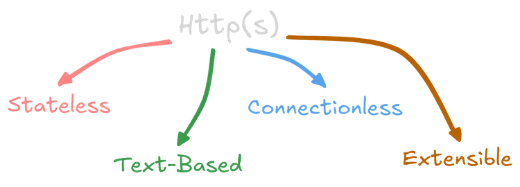

# HTTP (Hypertext Transfer Protocol) 
## What is HTTP?
HTTP is the **language of the web**. It is the set of rules that allows a web browser (client) and a web server to communicate and exchange data like web pages, images, and files.

---

## How HTTP Works (Request–Response Cycle)
1. **Client sends a request**
   Your browser asks the server for something (like a webpage).
2. **Server processes the request**
   The server finds or generates the requested data.
3. **Server sends a response**
   It sends back data (HTML, image, or error message) with a status code.
4. **Browser displays it**
   Your browser shows the content to you.
---

## Key Features of HTTP
* **Stateless**
  Each request is independent. The server does not remember past requests.
* **Text-based**
  Requests and responses are readable text (useful for debugging).
* **Extensible**
  Can be improved with new features without breaking old systems.
* **Connectionless**
  Connection closes after each request-response cycle.
