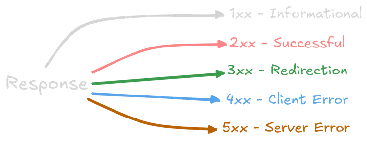

# HTTP Response Status Codes (Short Summary)

HTTP response status codes are 3-digit numbers sent by a server to show the result of a client’s request.

## Main Idea

* Client sends a request (e.g., GET a webpage)
* Server replies with a status code showing what happened

## Status Code Categories
### 1xx – Informational

* Request received, processing continues
* Rarely seen directly
* Example: 100 Continue

### 2xx – Success
* Request worked successfully
* Examples:

  * 200 OK → Everything worked fine
  * 201 Created → New resource created
  * 204 No Content → Success but no data returned

### 3xx – Redirection
* Resource moved, client must go somewhere else
* Examples:

  * 301 Moved Permanently
  * 302 Found (temporary redirect)

### 4xx – Client Error
* Problem with the request from the client
* Examples:

  * 400 Bad Request → Invalid request
  * 401 Unauthorized → Login required
  * 403 Forbidden → No permission
  * 404 Not Found → Page doesn’t exist

### 5xx – Server Error
* Problem on the server side
* Examples:

  * 500 Internal Server Error
  * 502 Bad Gateway
  * 503 Service Unavailable

## In Simple Words
* 2xx = Success
* 3xx = Move somewhere else
* 4xx = You made a mistake
* 5xx = Server made a mistake