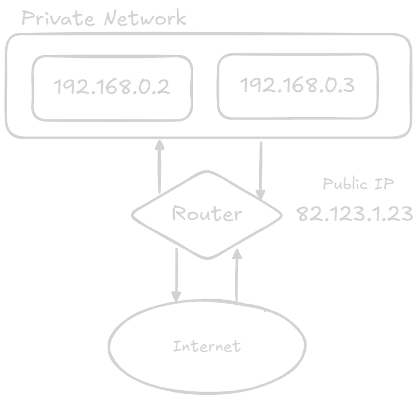

An IP address (Internet Protocol address) is a unique number given to every device connected to the internet. It works like a digital address, helping data find the correct device.
### Types of IP Addresses
- **IPv4**: Older version (e.g., 192.168.1.1), limited in number.
- **IPv6**: Newer version, provides a huge number of addresses.

![[ipaddress.png]]

### Public vs Private IP
- **Public IP**: Visible on the internet, given by ISP.
- **Private IP**: Used inside a local network (home, office).

### How It Works 
1. Your device sends a request.
2. Router converts private IP to public IP (NAT).
3. Request goes to the server.
4. Server sends response back.
5. Router sends it to your device.
    