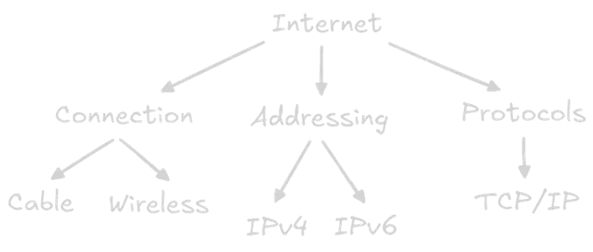

## The Internet
The internet is a huge global network that connects computers, phones, and smart devices so they can share information.

## How It Works
It works using three main things:
- **Connections** → cables (like fiber optics) and wireless signals (Wi-Fi, mobile data) that carry data
- **IP addresses** → unique IDs for each device (like a home address)    
- **Protocols (TCP/IP)** → rules that make sure data is sent, routed, and received correctly

