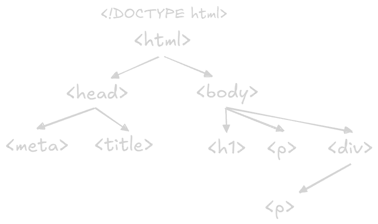

# HTML (HyperText Markup Language)
**HTML (HyperText Markup Language)** is the basic building block of every web page. It is a markup language used to structure content, not to create logic or behavior.

## What HTML Does
- Defines the structure of a webpage
- Uses **tags** to organize content
- Helps browsers understand how to display elements
    
## HTML Tags
- Written inside angle brackets: `< >`
- Usually come in pairs:
    - Opening tag: `<p>`
    - Closing tag: `</p>`
        
- Example:
    ```html
    <p>This is a paragraph.</p>
    ```

### Self-closing Tags
- Do not have closing tags
- Example:

    ```html
    
    ```    

## Attributes
- Provide extra information inside tags
- Written as name="value"
- Example:
    
    ```html
    <a href="https://example.com">Link</a>
    ```

## Basic HTML Structure



```html
<!DOCTYPE html>
<html>
  <head>
    <title>Page Title</title>
  </head>
  <body>
    <h1>Hello</h1>
    <p>This is a paragraph.</p>
  </body>
</html>
```